<div align="center">

# GXQS Explorer

**Enterprise-grade blockchain intelligence platform for the GXQS network.**

[](https://nextjs.org)
[](https://www.typescriptlang.org)
[](https://tailwindcss.com)
[](LICENSE)

</div>

---

## Overview

GXQS Explorer is a real-time blockchain explorer and command center built with Next.js 15 App Router, TypeScript, and Tailwind CSS. It provides live chain metrics, validator intelligence, mempool monitoring, AI-driven anomaly detection, and smart-contract deployment tooling in a single responsive interface.

---

## Screenshots

### Command Dashboard

The home screen surfaces a live KPI grid, TPS chart, block stream, and recent transactions — all driven by the GXQS chain API.

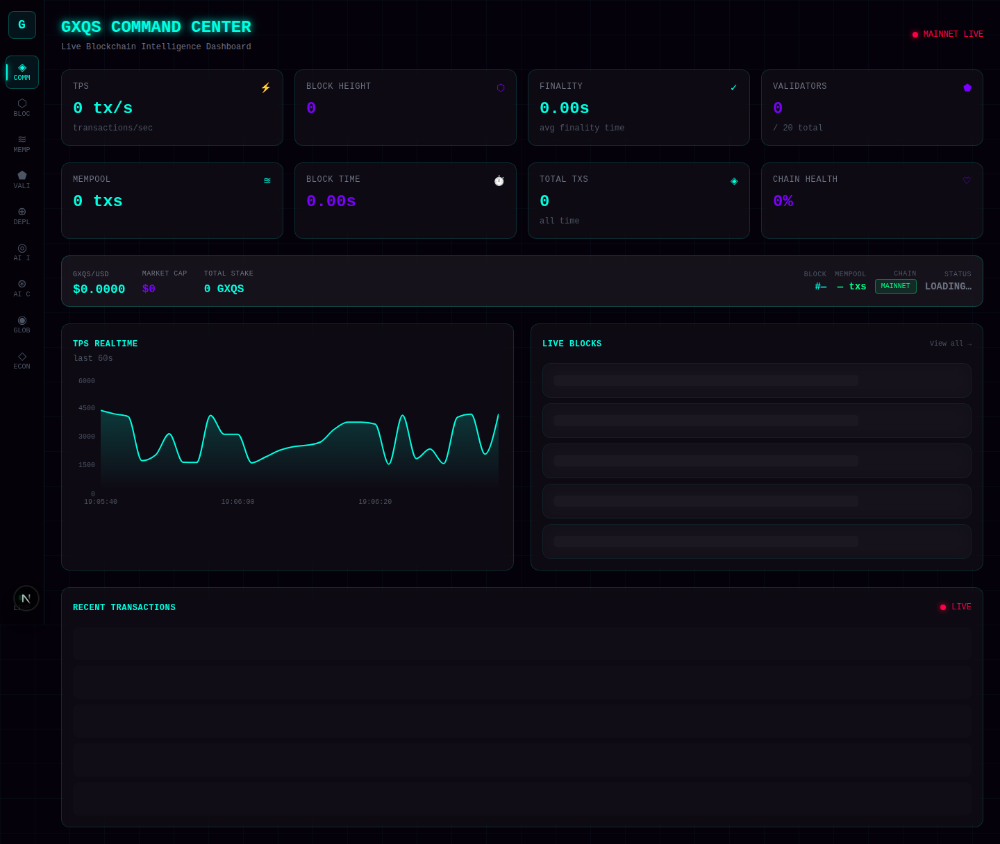

### Block Explorer

Drill into every block with timestamp, transaction count, gas metrics, and validator signature.

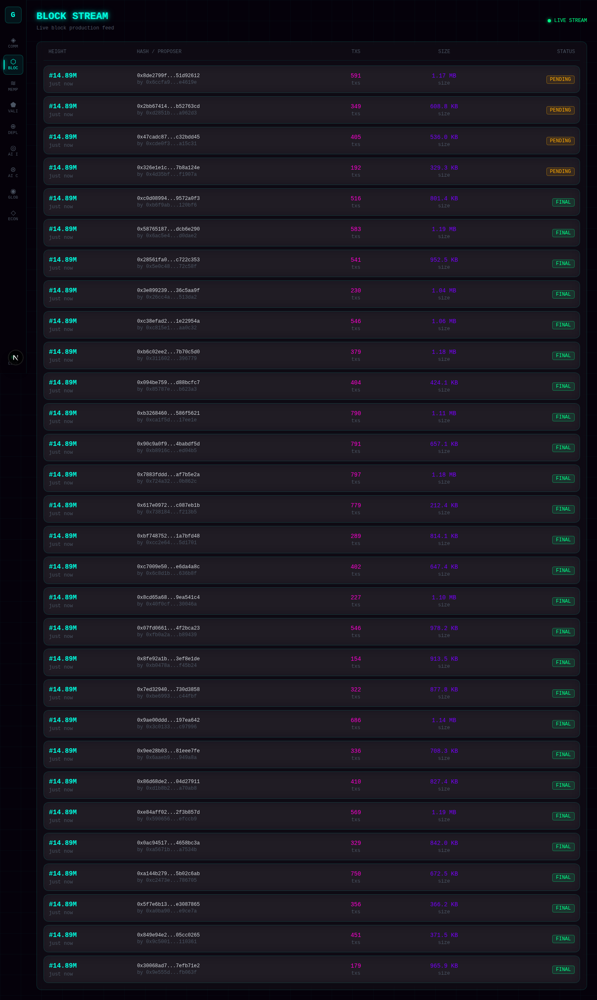

### Mempool Monitor

Real-time mempool view with fee distribution, transaction type breakdown, and alert badges when the backlog exceeds thresholds.

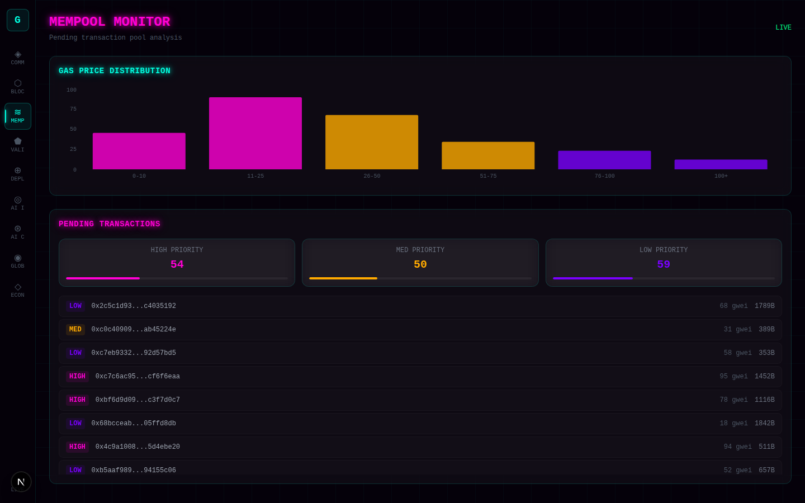

### Validator Intelligence

Leaderboard of active validators showing uptime, stake weight, blocks produced, and performance score.

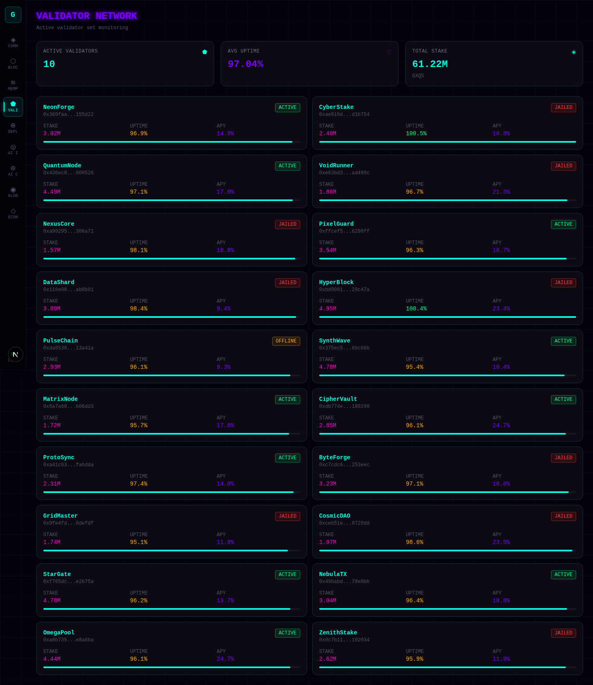

### AI Dashboard

On-chain anomaly detection and predictive analytics powered by the built-in AI layer.

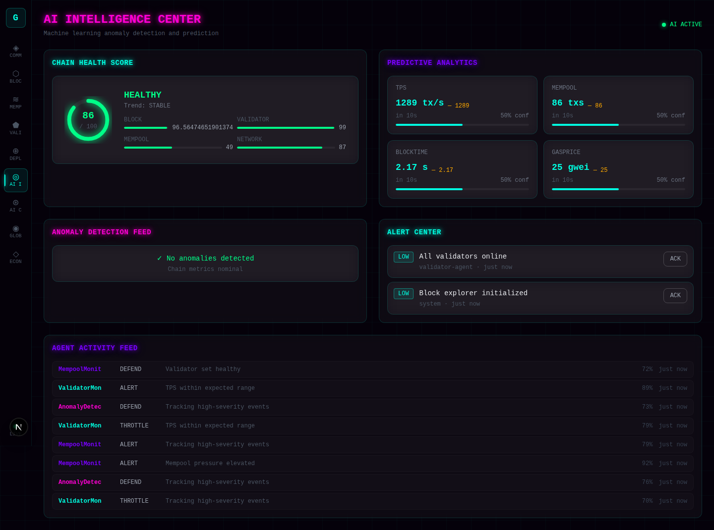

### AI Control

Interactive AI model controls — configure thresholds, retrain triggers, and view model confidence scores.

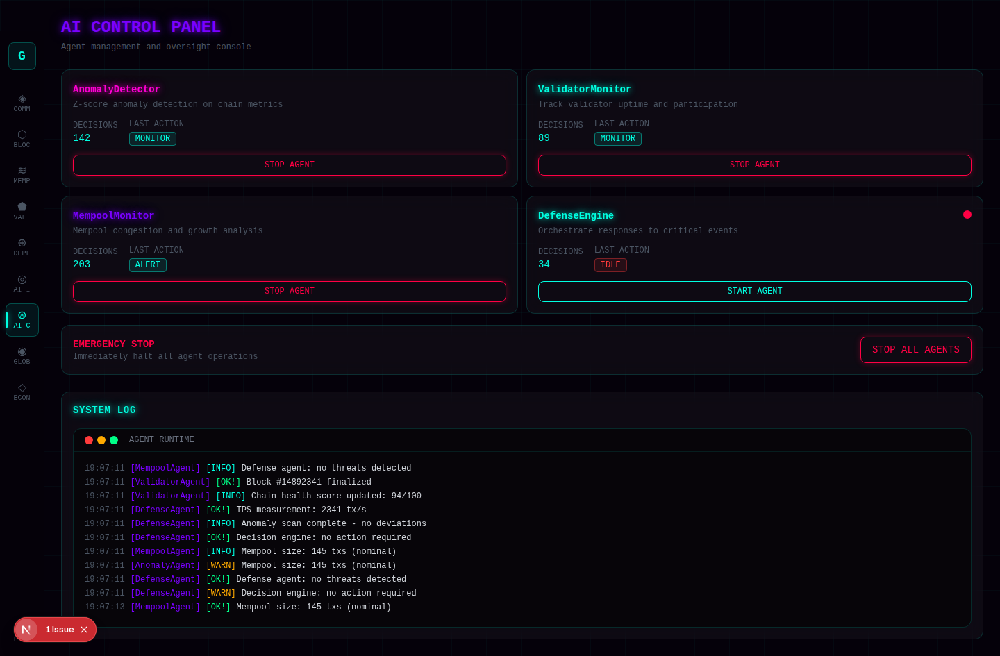

### Global Intelligence

Cross-chain and geo-distributed node health map with latency metrics per region.

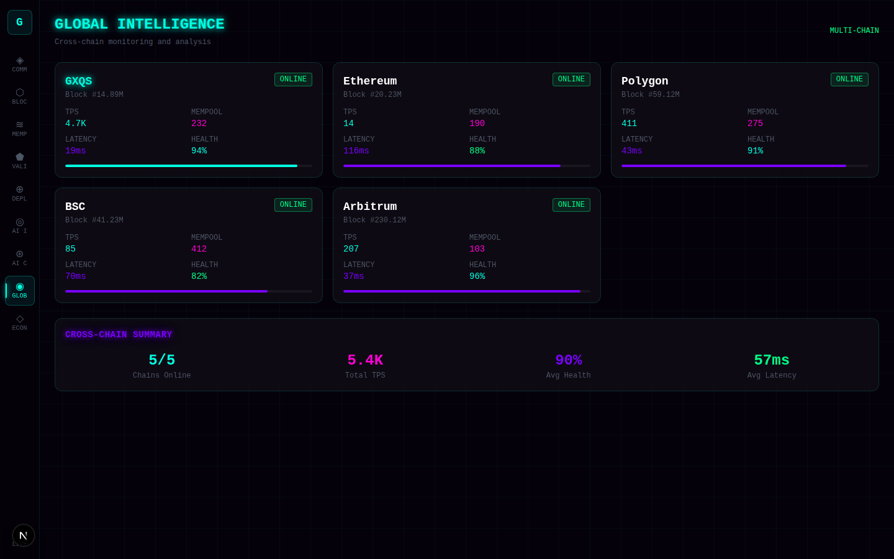

### Economic Intelligence

Tokenomics dashboard: price feed, market cap, staking ratio, circulating supply, and emission schedule.

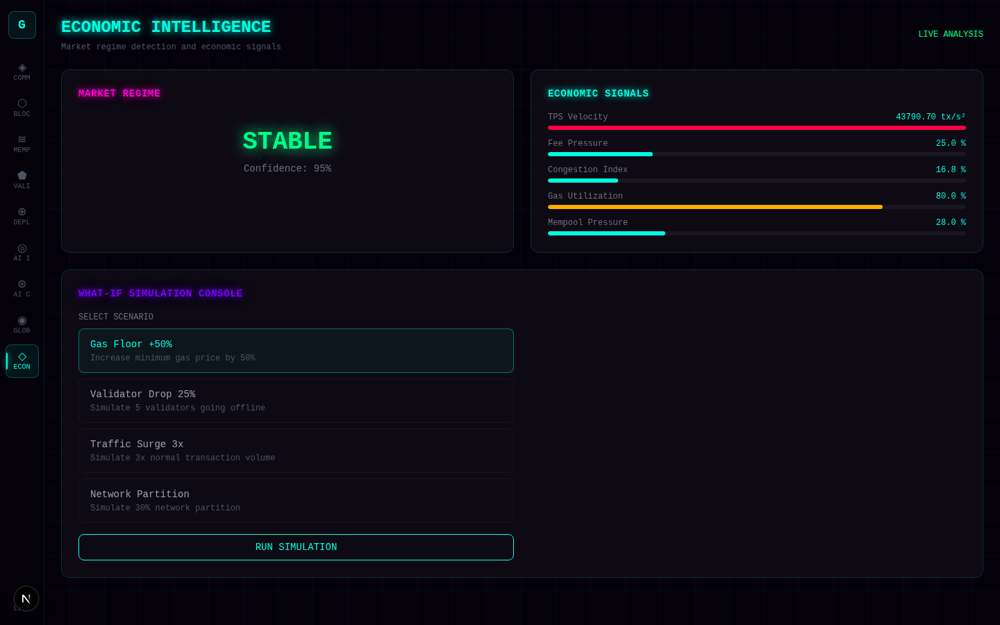

### Smart Contract Deploy

Guided deploy wizard with ABI upload, constructor argument builder, gas estimator, and live deployment status.

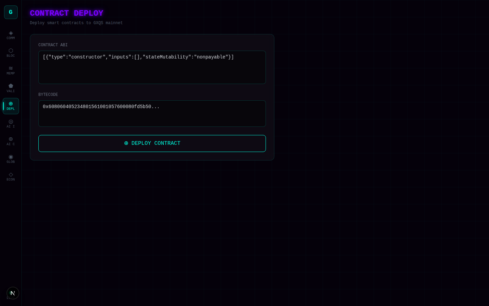

### Mobile — Responsive Layout

Bottom navigation bar on small screens with a collapsible **More** tray giving access to all nine routes.

<table>
  <tr>
    <td>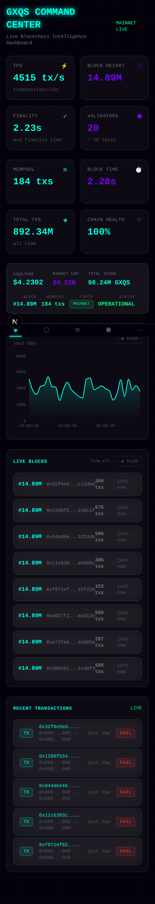</td>
    <td>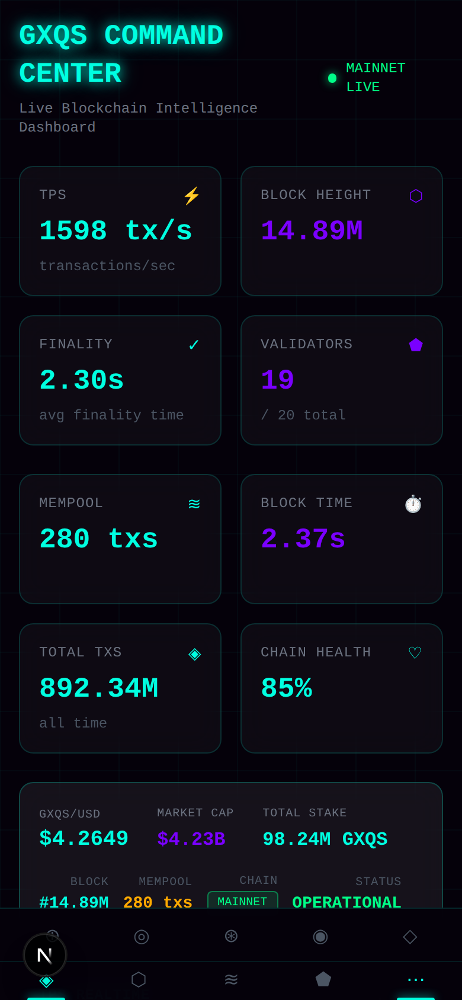</td>
  </tr>
  <tr>
    <td align="center">Dashboard (390 px)</td>
    <td align="center">More nav tray expanded</td>
  </tr>
</table>

---

## Design System

### Color Tokens

| Token       | Hex       | Usage                                  |
|-------------|-----------|----------------------------------------|
| `primary`   | `#00ffe1` | KPI values, active states, links       |
| `secondary` | `#7a00ff` | Secondary KPI, chart series            |
| `accent`    | `#ff00d4` | Decorative highlights                  |
| `success`   | `#00ff88` | Healthy states, confirmations          |
| `warning`   | `#ffaa00` | Degraded states, mempool overload      |
| `danger`    | `#ff3b3b` | Critical alerts, failed transactions   |

### Glassmorphism Depth Levels

| Class      | Background                    | Blur   | Border                          |
|------------|-------------------------------|--------|---------------------------------|
| `glass-l1` | `rgba(255,255,255,0.04)`      | 12 px  | `rgba(0,255,225,0.15)`          |
| `glass-l2` | `rgba(255,255,255,0.06)`      | 16 px  | `rgba(0,255,225,0.20)`          |
| `glass-l3` | `rgba(255,255,255,0.08)`      | 20 px  | `rgba(0,255,225,0.30)`          |

### Glow System

State-driven glow — no always-on glow.

```css
/* Hover: soft */
.glow-hover-primary:hover { box-shadow: 0 0 12px rgba(0,255,225,0.25); }
/* Active: strong */
.glow-active-primary      { box-shadow: 0 0 20px rgba(0,255,225,0.5), 0 0 40px rgba(0,255,225,0.2); }
/* Critical: pulsing animation */
.animate-glow-pulse-warning { animation: glowPulseWarning 1.5s ease-in-out infinite; }
.animate-glow-pulse-danger  { animation: glowPulseDanger  1s   ease-in-out infinite; }
```

---

## Architecture

```
app/                    Next.js App Router pages
├── page.tsx            Home — Command Dashboard
├── blocks/             Block explorer
├── mempool/            Mempool monitor
├── validators/         Validator leaderboard
├── deploy/             Contract deploy wizard
├── ai-dashboard/       AI anomaly dashboard
├── ai-control/         AI model controls
├── global-intelligence/ Cross-chain node map
├── economic-intelligence/ Tokenomics
└── api/                Mock RPC API routes

components/
├── explorer/           Page-level smart components
│   ├── CommandDashboard.tsx   Live KPI grid + identity bar
│   ├── Navigation.tsx         Sidebar (≥md) + bottom nav (<md)
│   ├── BlockStream.tsx
│   ├── TransactionList.tsx
│   └── ...
└── ui/                 Design-system primitives
    ├── GlassCard.tsx          Glassmorphism card (depth prop)
    ├── StatCard.tsx           KPI card (primary | secondary)
    ├── NeonBadge.tsx          Semantic badge (design-token colors)
    ├── ChartCard.tsx          Collapsible chart wrapper
    ├── ActivityFeed.tsx       Feed list with accent lines
    ├── LiveIndicator.tsx      Data-driven live dot
    └── ...

lib/
├── rpc.ts              Mock blockchain data (GXQS chain simulation)
└── utils.ts            Formatting helpers

styles/
└── globals.css         CSS custom properties + utility classes
```

> **Note:** `lib/rpc.ts` contains a simulated GXQS chain RPC layer. All blockchain data is generated with realistic values. No live RPC endpoint is required to run the explorer.

---

## Quick Start

```bash
# Install dependencies
npm install

# Start development server
npm run dev
# → http://localhost:3000

# Production build
npm run build
npm start

# Lint
npm run lint
```

**Requirements:** Node.js 18+, npm 9+

---

## Key Features

| Feature | Detail |
|---|---|
| **Real-time KPIs** | TPS, block height, finality, validator count, mempool size, chain health — auto-refresh every 2 s |
| **Blockchain Identity Bar** | Live block ticker, mempool counter with warning threshold, MAINNET badge, data-driven network status |
| **Responsive Navigation** | Full sidebar on desktop; 4-item bottom bar + expandable "More" tray on mobile |
| **Collapsible Charts** | Toggle hidden on desktop; mobile-only collapse control with `aria-expanded` |
| **AI Anomaly Detection** | On-chain pattern analysis with configurable sensitivity thresholds |
| **Smart Contract Deploy** | ABI-driven wizard with gas estimation |
| **Performance** | Chart components wrapped in `React.memo`; `TpsChart` lazy-loaded; SWR deduplicated polling |

---

## License

[MIT](LICENSE) © GXQS
